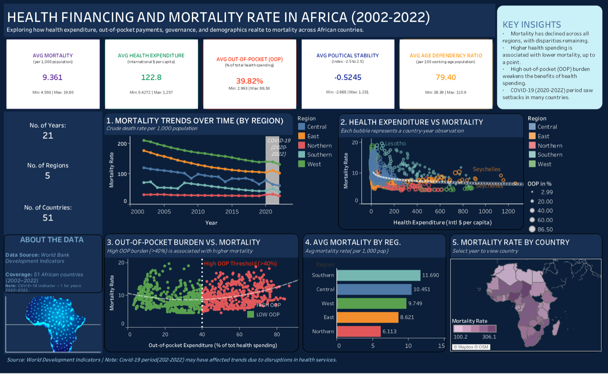

# Health Financing and Mortality in Africa, 2002-2022

This repository contains the data, statistical analysis code, and a static
dashboard associated with the manuscript:

> **Beyond Spending: Nonlinear Impacts of Health Financing and Out-of-Pocket
> Costs on Mortality in Africa**
>
> Denis Folitse, Christopher Odoom, Alexander Boateng, and Luis Alberiko
> Gil-Alaña

The manuscript has been submitted to **Health Economics (Springer Nature)**.

[](dashboard/health_financing_mortality_africa_dashboard.pdf)

The study examines how domestic government health expenditure, out-of-pocket
health spending, political stability, and age dependency are associated with
crude mortality rates. It uses a country-year panel covering 51 African
countries over 2002-2022 and applies descriptive analysis, linear regression,
and generalized additive models (GAMs) to evaluate potentially nonlinear
relationships.

> **Submission status:** The manuscript is under journal review. Results in
> this repository should be treated as pre-publication findings and may change
> during peer review.

## Research Objectives

The analysis is designed to investigate:

1. How mortality and health-financing indicators changed across African
   countries and regions between 2002 and 2022.
2. Whether government health expenditure per capita, out-of-pocket spending,
   and political stability are associated with crude mortality rates.
3. Whether these associations are nonlinear or vary by African region.
4. Whether the relationship between government health expenditure and
   mortality depends on the level of out-of-pocket spending.
5. Whether the observed relationships remain after accounting for age
   dependency, country-level heterogeneity, time trends, lagged exposures, and
   the COVID-19 period.

The study is observational. Associations estimated by the models should not be
interpreted as causal effects.

## Study Design

- **Unit of analysis:** country-year
- **Geographic coverage:** 51 African countries grouped into Central, East,
  Northern, Southern, and West regions
- **Study period:** 2002-2022
- **Outcome:** crude death rate per 1,000 people
- **Primary exposures:** domestic government health expenditure per capita,
  out-of-pocket expenditure, and political stability
- **Additional covariates:** age dependency ratio, calendar year, country
  random effect, and a COVID-19-period indicator
- **Excluded countries:** Somalia, South Sudan, and Zimbabwe
- **Data source:** World Bank World Development Indicators and Worldwide
  Governance Indicators downloads

The script identifies African countries using `countrycode`, removes the three
excluded countries, assigns each retained country to one of five study regions,
reshapes each indicator to long format, and joins the indicators by country,
year, and region. Because the merged panel uses inner joins and the models use
complete observations, effective model sample sizes depend on data availability
for the included variables.

## Data Dictionary

| Analysis variable | World Bank indicator | Definition and unit | Role |
|---|---|---|---|
| `Mortality` | `SP.DYN.CDRT.IN` | Death rate, crude, per 1,000 people | Outcome |
| `HealthExp` | `SH.XPD.GHED.PP.CD` | Domestic general government health expenditure per capita, PPP, current international dollars | Primary exposure |
| `Oop` | `SH.XPD.OOPC.CH.ZS` | Out-of-pocket expenditure as a percentage of current health expenditure | Primary exposure |
| `Polstab` | `PV.EST` | Political Stability and Absence of Violence/Terrorism estimate | Primary exposure |
| `Agedep` | `SP.POP.DPND` | Dependents per 100 working-age people | Covariate |
| `Covid19` | Constructed in the script | `1` for 2020-2022 and `0` otherwise | Period indicator |
| `Region` | Constructed in the script | Study-specific African regional grouping | Stratification variable |

The source CSV files were downloaded from the World Bank and report a last
updated date of **July 1, 2025**. The analysis intentionally uses only
2002-2022 observations. Each data directory also contains the corresponding
country and indicator metadata supplied with the download.

## Statistical Analysis

The main script, [`R/Analysis_mort_exp.R`](R/Analysis_mort_exp.R), performs the
following analyses:

1. Produces country and regional time-series plots for all study variables.
2. Calculates descriptive statistics, correlations, scatterplot matrices, and
   regional boxplots.
3. Uses linear models and variance inflation factors as an initial
   multicollinearity and association check.
4. Fits GAMs to allow nonlinear relationships between mortality and the study
   variables.
5. Adds a random-effect smooth for country and a smooth calendar-time trend.
6. Fits models using one-year-lagged health expenditure and political
   stability.
7. Evaluates a tensor-product interaction between lagged government health
   expenditure and out-of-pocket expenditure.
8. Repeats models separately for the five study regions.
9. Conducts a restricted-sample analysis excluding observations with mortality
   rates of 20 or more and government health expenditure of 1,000 or more.

The principal adjusted lagged GAM is specified conceptually as:

```text
Mortality =
  s(lagged government health expenditure)
  + s(out-of-pocket expenditure)
  + s(lagged political stability)
  + s(age dependency ratio)
  + COVID-19 period indicator
  + interaction(lagged government health expenditure, out-of-pocket expenditure)
  + country random effect
  + s(year)
```

Models are estimated with the `mgcv` package, using restricted maximum
likelihood (`method = "REML"`) for the lagged and regional specifications.
Model diagnostics and smooth visualizations are produced with `mgcv` and
`gratia`.

## Repository Structure

```text
.
├── R/
│   └── Analysis_mort_exp.R
├── dashboard/
│   ├── health_financing_mortality_africa_dashboard.pdf
│   └── health_financing_mortality_africa_dashboard.png
└── data/
    ├── age_dependency_ratio/
    ├── death_rate/
    ├── health_expenditure/
    ├── out_of_pocket_expenditure/
    └── political_stability/
```

- `R/Analysis_mort_exp.R` contains the complete data preparation, exploratory
  analysis, model fitting, diagnostics, and sensitivity analyses.
- Each directory under `data/` contains one World Bank indicator CSV plus its
  country and indicator metadata files.
- `dashboard/health_financing_mortality_africa_dashboard.pdf` is a
  one-page static summary dashboard. The dashboard-authoring source is not
  included, so the PDF is not regenerated by the R script.
- `dashboard/health_financing_mortality_africa_dashboard.png` is a cropped,
  web-friendly preview displayed in this README.

Run the analysis from the repository root so the script can resolve the
relative paths under `data/`.

## Reproducing the Analysis

### Requirements

- R 4.1 or later, because the script uses the base R pipe (`|>`)
- An R graphics-capable environment such as RStudio
- The following R packages:

```r
install.packages(c(
  "readr", "dplyr", "tidyr", "stringr", "countrycode", "ggplot2",
  "GGally", "scales", "plotly", "ggrepel", "mgcv", "car", "gratia",
  "psych", "e1071", "glue", "purrr", "flextable", "officer"
))
```

### Run

Clone the repository, open R from the repository root, and run:

```bash
Rscript R/Analysis_mort_exp.R
```

Alternatively, open `R/Analysis_mort_exp.R` in RStudio and source it
interactively. The interactive approach is recommended because the script
creates many plots and model diagnostic panels.

The script:

- clears the active R environment when it starts;
- reads only the included local CSV files and does not download data;
- prints summaries, correlations, model results, and diagnostics to the R
  console;
- displays plots during execution; and
- does not automatically save the fitted models, tables, or figures.

Several export commands are present but commented out. Uncomment them only
after confirming the intended output paths and formats.

## Dashboard

The included static dashboard summarizes study coverage and descriptive
patterns, including mortality trends, health expenditure versus mortality,
out-of-pocket spending versus mortality, regional average mortality, and a
country-level mortality map.

Click the dashboard image near the top of this README to open the full PDF.

The dashboard reports 51 countries, five regions, and 21 years of data.
Dashboard values are descriptive and should not be read as adjusted model
estimates or causal effects.

## Reproducibility Notes

- World Bank indicators may be revised after download. The included snapshots
  are retained to preserve the data used for this analysis.
- Missing indicator values produce an unbalanced panel and different effective
  samples across models.
- The COVID-19 variable is a period indicator for 2020-2022; it does not
  measure country-specific pandemic exposure or policy response.
- Region assignments are defined directly in the analysis script and should be
  interpreted as study-specific groupings.
- The restricted-sample analysis is a sensitivity analysis based on explicit
  outcome and expenditure thresholds.
- No package lockfile is currently included, so future package updates may
  produce small differences in model fitting or graphics.

## Data Ethics and Availability

All data are aggregate, country-level indicators from publicly available World
Bank sources. The repository contains no individual-level or personally
identifiable information.

Indicator documentation and current versions are available through the
[World Bank DataBank](https://databank.worldbank.org/) and
[Worldwide Governance Indicators](https://www.worldbank.org/en/publication/worldwide-governance-indicators).

## Citation

The manuscript is currently under review. Until a final citation and DOI are
available, please cite it as:

> Folitse, D., Odoom, C., Boateng, A., & Gil-Alaña, L. A. (under review).
> *Beyond Spending: Nonlinear Impacts of Health Financing and Out-of-Pocket
> Costs on Mortality in Africa*. Submitted to Health Economics, Springer
> Nature.

Please also cite the World Bank indicator sources when reusing the included data
snapshots.

## License

The original code and documentation in this repository are licensed under the
[MIT License](LICENSE). The included World Bank data snapshots are not covered
by the MIT License and remain subject to the
[World Bank Terms and Conditions](https://www.worldbank.org/en/about/legal/terms-of-use-for-datasets).
